# How does transfer learning deploy the model for training traffic sign pictures on Arduino?

Mengyun Zeng

## Introduction
Traffic sign recognition is a challenging computer vision recognition project. Its characteristic is that in the real world, traffic signs have huge environmental differences. For example, the light changes day and night, and the shape of the picture changes according to the angle of the camera. The clarity will vary depending on the distance. (Stallkamp et al., 2012)
Computer recognition technologies such as image recognition have been constantly updated and improved. The mainstream deep learning algorithms, including deep neural networks, have been continuously improving the recognition technology of traffic signs, and the training results have become more satisfactory. But for the image recognition of traffic signs, the implementation of training results on specific equipment has not been implemented in large numbers, and the effect is rarely quantified. So much so that conclusions in this regard are rarely mentioned.
This project uses edge impulse to simulate the training of the traffic sign recognition model on the Arduino device and uses ArduCAM to simulate the application scenario of a portable device, and finally shows the accuracy and loss of our training results.

## Research Question
How does transfer learning deploy the model for training traffic sign pictures on Arduino, and what is the effect?

## Application Overview
The first is data collection. This article collects a large number of pictures of various traffic signs from the Kaggle website and divides them into a training set and a test set. Then convert the picture into a format that can be used in this practice.
Then there is model training. This article first tries to use the built-in TensorFlow model to directly train traffic sign images on Google collab and then converts the model into a Tensorflow lite format model. Secondly, we will simulate our model on the edge impulse, and select the best model by adjusting the parameter, and save it.
Next, replace the person detection model in the Arduino IDE library with the result of the previously trained model to convert the person detection model into a traffic sign recognition model. In this way, the mini device combined with Arduino and Arducam can be used to recognize traffic signs anytime and anywhere, as an auxiliary device in the process of driving the car, helping the driver to see those traffic signs that have been ignored.
Finally, the Device reminds the driver by displaying LED lights of different colors. It can also be optimized as an external speaker to remind the driver by voice.

## Data
The data comes from pictures classified as traffic signs on the Kaggle website. Traffic signs including stop, no-pass, left and right are selected, and the corresponding name labels are attached to them respectively.

Figure 1 traffic sign : stop,left,right,no-pass

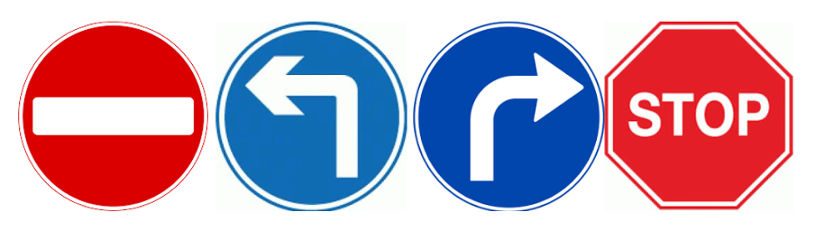

As set in the edge impulse, it splits the data 80/20 between training and testing data. Uses the hash of the file to determine in which category it's placed, so the same files always end up in the same category.
To simulate the real-time situation on the Arduino more accurately, we modified the picture to Grayscale format and changed the size to 48*48, although the 96*96 size picture can make the transfer learning blocks get optimal accuracy. Because the current model size that Arduino can implement is limited, the model trained with 96*96 size pictures is too large for Arduino to be implemented. After adjustment, we found that 48*48 training for the model in this article is based on the model. A compromise between precision and size. The reason for choosing the Grayscale format is that Ardu CAM currently only recognizes Grayscale pictures and cannot support RGB pictures.

## Model
For classification and recognition, this article first tries to use Sequential based on a convolutional neural network to train pictures, but it takes a lot of pictures to train, which is time-consuming and laborious. Although I Enforce integer only quantization to reduce the model size, the final model is still too large to be loaded by Arduino. Later, this research introduced a traffic sign recognition and classification method based on transmission learning, using a lightweight training model mobilenetv2, which significantly reduces the amount of training data and reduces computational consumption, so it is very suitable for Mobile Devices.

Figure 2 : transfer learning

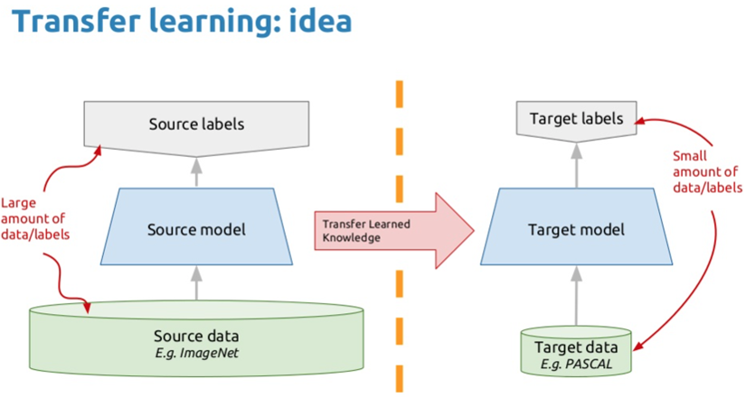

Source: https://bouzouitina-hamdi.medium.com/transfer-learning-with-keras-using-densenet121-fffc6bb0c233

Figure 3 : MobileNetV2 Model

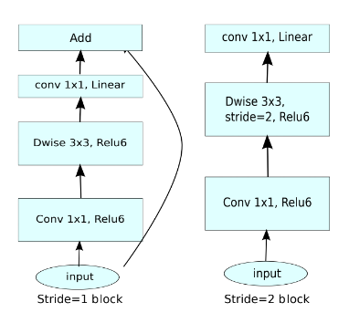

Source: Mark Sandler

As we can see in the figure, in MobileNetV2, there are two types of blocks. One is a residual block with a stride of 1, and the other is a block with a stride of 2 to reduce the size. Both types of blocks have 3 layers. The first layer is 1×1 convolution with ReLU6. The second layer is deep convolution. The third layer is another 1×1 convolution, but without any nonlinearity. It is said that if ReLU is used again, the deep network only has the function of a linear classifier in the non-zero volume part of the output domain (Sandler et al., 2018). 

## Experiments
As the picture shows below, I need to change the four parameters to optimize the model, so my experiment will focus on these four parameters. First, adjust the number of train cycles: choose a compromise between accuracy and time epochs. Adjust the Learning rate parameter, which means how fast the neural network learns, if the network overfits quickly, then lower the learning rate. Then, select While data augmentation, which means, randomly transform data during training. And allows us to run more training cycles Without overfitting, which can improve accuracy. Finally, adjust the Minimum confidence rating parameter, which is the threshold score for trusting the neural network. If the confidence rating is below this value, the sample will be tagged as 'uncertain'.

Figure 4 : Parameters

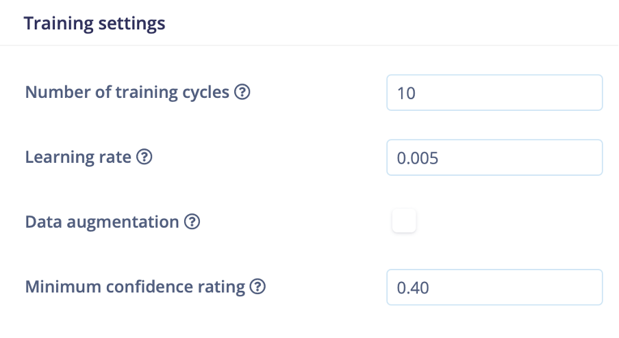

## Results and Observations
All results are saved in the form of (quantized(int8) because Arduino only accepts models in the form of int8.

1.	Adjust the number of train cycles:
Control the Learning rate to 0.05, turn off data augmentation and minimum confidence rating to 0.06.

Table 1 : Result of adjusting the number of train cycles

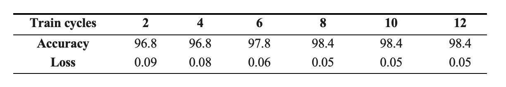

From the above table, we can see that when train cycles are greater than 8, the model has the best accuracy and loss, which are 98.4 and 0.05, respectively.

2.	Adjust Learning rate: 
Control train cycles to 10, turn off data augmentation, Minimum confidence rating to 0.06.

Table 2 : Result of adjusting Learning rate

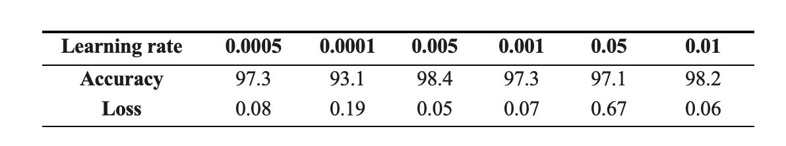

From the above table, we can see that when the learning rate is equal to 0.005, the model has the best accuracy and loss.

3.	Adjust whether data augmentation: 
Control the train cycles to 10, Learning rate to 0.05, Minimum confidence rating to 0.06.

Table 3 : Result of adjusting data augmentation

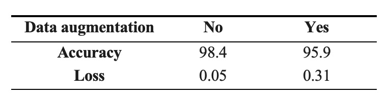

According to the above table, compared with no enhancement method, the verification accuracy of the enhancement method is lower.
In other words, the intensifier trains the network to rotate and translate traffic sign images, and these images do not exist in the real world or are conflicting. This means that geometric enhancement does not provide any additional benefits, and can play a role in reducing the verification accuracy, as shown here.(Elgendi et al., 2021)

4.	Adjust minimum confidence rating:
Control the train cycles to 8, Learning rate to 0.05, and minimum confidence rating to 0.06.

Table 4 : Result of adjusting minimum confidence rating

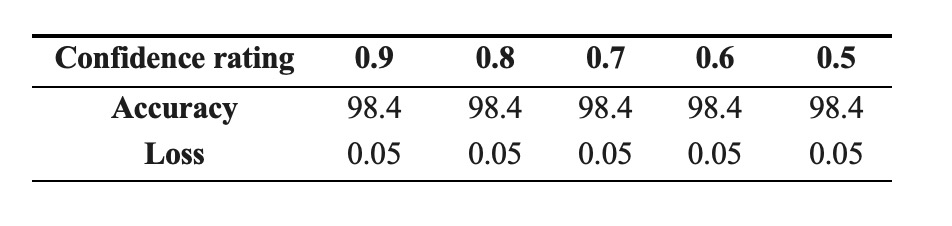

It can be seen from the results of the above table that the confidence rating has no improvement effect on the model of this experiment, and the accuracy and loss have been maintained at 98.4 and 0.05, respectively.

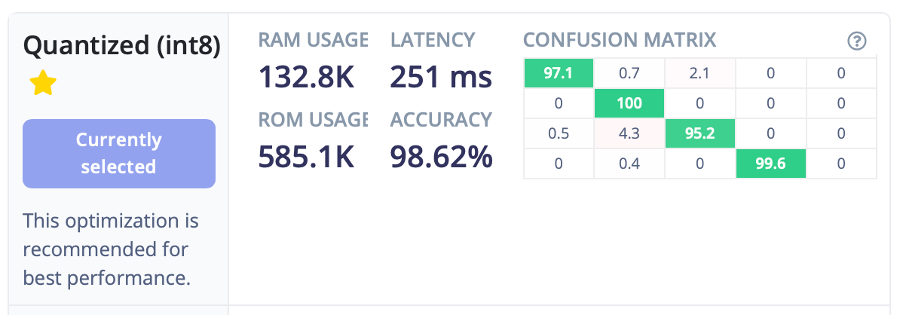

All in all, in the experiment, I conducted repeated training on the transfer learning-based model, and fine-tuned the parameters at different learning rates, and observed good reliability and repeatability based on statistical analysis. The results show that the transfer learning model can achieve a high level of recognition performance in traffic sign recognition. At a learning rate of 0.005, the recognition accuracy is as high as 98.6%, the loss degree reaches 0.05, and the RAM usage is also controlled at 585.1k.

Figure 5: Running result in Arduino

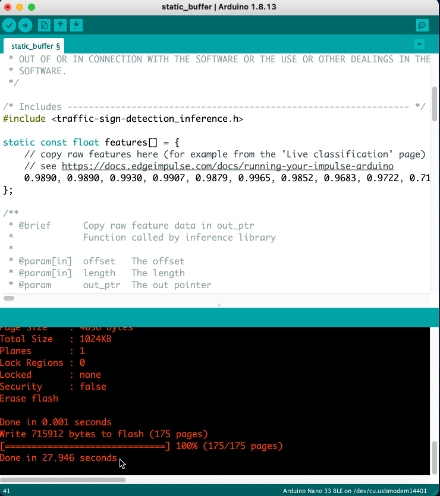

As showing in the terminal, the model is 715912 bytes and can deploy in nearly 28 seconds

Figure 6 : The test result

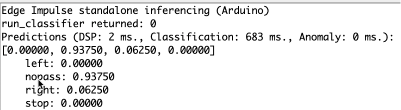

Finally, through edge impulse, this experiment deployed the model to the Arduino and found that the model in the Arduino can successfully recognize the traffic sign picture as showing in the picture above, but the task of replacing the model with person detection was unsuccessful. I will also in the future, Have been trying to achieve this function.

## Bibliography
Elgendi, M., Nasir, M. U., Tang, Q., Smith, D., Grenier, J. P., Batte, C., Spieler, B., Leslie, W. D., Menon, C., Fletcher, R. R., Howard, N., Ward, R., Parker, W. and Nicolaou, S. (2021). ‘The Effectiveness of Image Augmentation in Deep Learning Networks for Detecting COVID-19: A Geometric Transformation Perspective’. Frontiers in Medicine, 8 (March), pp. 1–12. doi: 10.3389/fmed.2021.629134.

Sandler, M., Howard, A., Zhu, M., Zhmoginov, A. and Chen, L. C. (2018). ‘MobileNetV2: Inverted residuals and linear bottlenecks’. arXiv, pp. 4510–4520.

Stallkamp, J., Schlipsing, M., Salmen, J. and Igel, C. (2012). ‘Man vs. computer: Benchmarking machine learning algorithms for traffic sign recognition’. Neural Networks. Elsevier Ltd, 32, pp. 323–332. doi: 10.1016/j.neunet.2012.02.016.

## Link of 

Edge impulse:
https://studio.edgeimpulse.com/public/22042/latest/learning/keras-transfer-image/5

Github:
(Unsuccessful attempt)
https://github.com/zengzmy/casa0018/blob/main/Assessment/Projects/Final%20Project/CASA0018_2_3_Cats_v_Dogs.ipynb
----

## Declaration of Authorship

I, Mengyun Zeng, confirm that the work presented in this assessment is my own. Where information has been derived from other sources, I confirm that this has been indicated in the work.

*Mengyun Zeng*

29 April 2021
